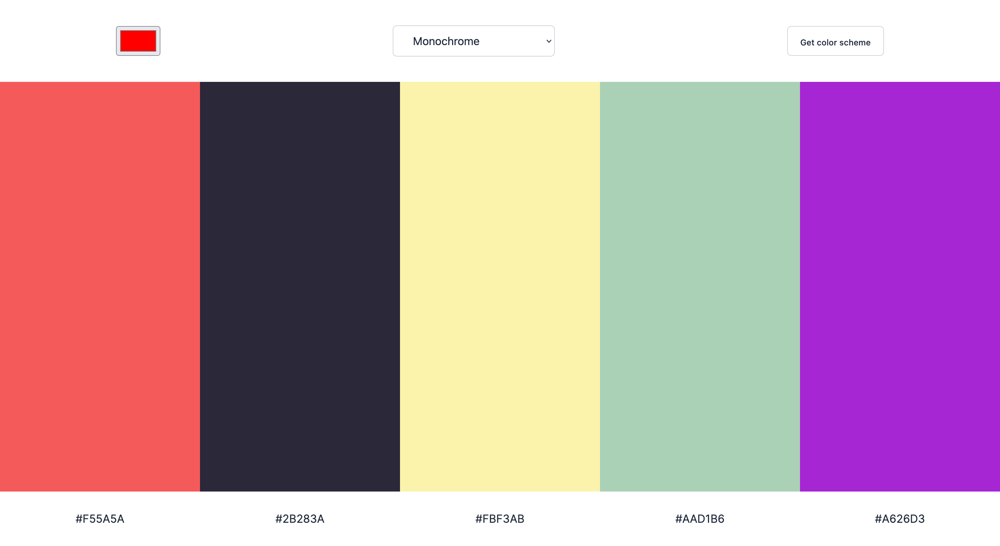

# Color Scheme Generator

This is a project of the [Scrimba](https://scrimba.com) Frontend Career Path.

## About The Project

The project aims to generate a color scheme using [The Color API](https://www.thecolorapi.com/). Different color schemes are generated: monochrome, monochrome dark, monochrome light, analogic, complement, analogic-complement and triad.

Live site: https://color-scheme-generator-by-alphfonti.netlify.app

## Buitl with

- [The Color API](https://www.thecolorapi.com/)

## Acknowledgments

- [Chiamaka Ikeanyi](https://chiamakaikeanyi.dev/how-to-copy-text-with-ease-in-javascript-using-the-clipboard-api/)
